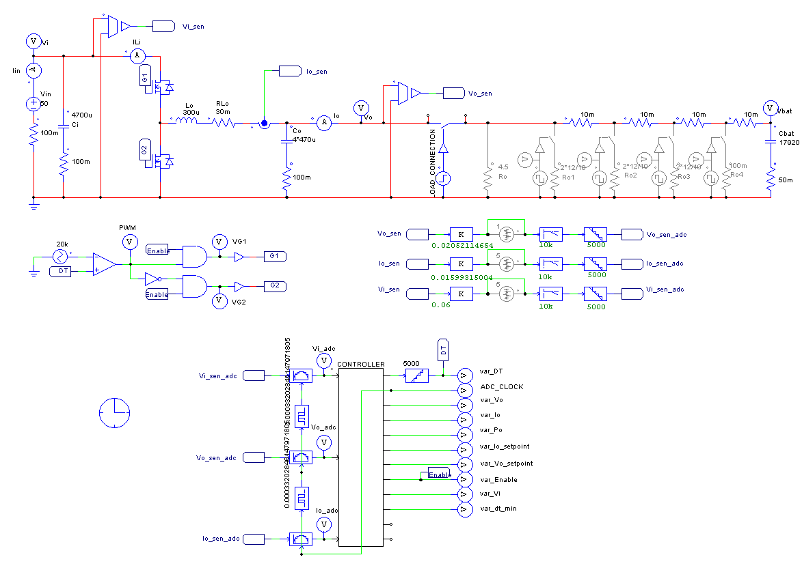

# MCB19

**M**ódulo **C**arregamento das **B**aterias 2019 

Embarcação Guarapuvu II

Equipe Zênite Solar


### Sobre

Este módulo é responsável por carregar e gerenciar a carga da bateria auxiliar (rádio e bombas de porão) e da bateria extra (direção elétrica) a partir da energia da bateria principal.


#### Requisitos

1. Carregar a bateria

   - Carregar por CC e CV
      - Controlar a tensao com controlador PI em cascata com controlador PI de corrente.

   - Proteções
      - Sobrecorrente na entrada e saída
      - Curto-circuito na entrada e saída
      - Sobre/sub-tensão na entrada e saída
      - Não permitir corrente da saída para a entrada: Um relé em série com a carga é usado para permitir a leitura da tensão na saída antes de entregar corrente para ela, seguindo as seguintes regras:
        - Somente ligar o relé da saída quando o sistema estiver em regime (sem oscilações na entrada ou na saída).
        - Somente ligar o relé da saída quando a tensão na bateria estiver em niveis dentro do esperado. 

2. Monitoramento do estado das baterias

   - Enviar pela rede CAN:
      - Corrente de carga
      - Tensão da bateria
      - Tensão da bateria principal
### Abordagens

 1. Especificação do conversor
   - Tensão de entrada: 30-50V
   - Corrente de saida: 8A
   - Tensão de saida: 10-15V

   Como no sistema, a tensão da bateria principal (entrada) será sempre maior que a tensão a tenão da bateria extra/auxiliar (saída), foi escolhido projetar um conversor estatico CC-CC Buck, com chaveamento síncrono (dois mosfets) para maior obter eficiencia.
   #### [Projeto do Buck](https://github.com/ZeniteSolar/MCB19/blob/master/control/buck.ipynb)
   
   - Para as condições especificadas anteriormente foram escolhidos:
      - Capacitor de saida: 200uF
      - Indutor de saida 300uH
 2. Controlador
   - Por sua simplicidade de implementação e por permitir ajustes empíricos, controladores PI foram escolhidos para controlar tanto a tensão de saída quanto a corrente de saída.
   
   [Referencia](https://e2e.ti.com/cfs-file/__key/communityserver-discussions-components-files/902/PI-controller-equations.pdf)
 
 3. Simulações
   - Para a simulação foi usado o programa Psim pois ele oferece a simulação de bloco C onde foi possivel simular de uma forma simplificada o comportamento do atmega328p, alem de ter ferramentas para controle.

<table width="100%">
  <tr>
    <th width="35%"> </th>
    <th width="65%"></th>
  </tr>
</table>

   4. Hardware
   - Para o design da Placa de circuito impresso (PCB) foi utilizado o software KiCad por ser uma ferramenta OpenSource. A PCB foi fabricada usando transferencia termica.
   
   #### É importante a utilização de snubber para amortecer os picos de tensão nas chaves
   
   5. Firmware
   - A cada interrupção do ADC é chamada a função de controle. Ao finalizar a maquina de estados é executada onde as mensagens CAN são enviadas e recebidas.
   
### [src/conf.h](firmware/src/conf.h)

Configurações gerais do sistema
```C
//#Definições do conversor
#define VO_SETPOINT 	13.2
#define IO_MAX      	8
#define VI_MIN      	21
```
### [src/adc.c](firmware/src/adc.c)
   No arquivo adc.c são lidos os valores dos ADCs e convertidos a valores "humanos", tambem é chamada a função de controle
   - Coeficientes de linearização
      - Com estes coeficientes é convertido o valor lido pelo ADC em uma unidade de medida 
```C
    static const float vi_coeff = 0.06582490575070313f;                                         
    static const float vo_coeff = 0.06717781789490249f;                          
    static const float io_coeff = 0.01599315004f; 
```
### [src/control.c](firmware/src/control.c)
   No arquivo control.c é executado o algoritmo de controle (PiVo em cascata com PiIo), para sintonizar o controlador tem que mudar as constantes Kp e Ti

```C

/*          PI CONTROL ALGORITHM - SERIES IMPLEMENTATION
** /desc    Algoritimo para Controlador Proporcional Integrativo Diferencial.
**  ref1: 
https://e2e.ti.com/cfs-file/__key/communityserver-discussions-components-files/902/PI-controller-equations.pdf

** /var r é o valor desejado para a saída, o 'set-point'.
** /var y é o valor da saída.
** /ret     retorna a ação de controle u.
*/
inline float piVo(float r, float y){
    // PI CONFIGURATIONS:
    const float Kp = 0.5;           // analog series proportional gain
    const float Ti = 0.1;          // analog series integration period
    const float Ts = PERIOD;        // digital sampling period

    // INTERNAL CONSTANTS COMPUTATION:
    const float a0 = -Kp;           // IIR coefficient for old sample
    const float a1 = Kp*(1+Ts/Ti);  // IIR coefficient for new sample

    // CONTROLLER STATIC VARIABLES
    static float e0 = 0;            // old error
    static float e1 = 0;            // new error
    static float u = 0;             // control action

    // Compute error:
    e0 = e1;
    e1 = r -y;

    // Compute control action:
    u += + a1*e1 + a0*e0;

    return u;
}

inline float piIo(float r, float y){
    // PI CONFIGURATIONS:
    const float Kp = 0.001;         // analog series proportional gain
    const float Ti = 0.001;         // analog series integration period
    const float Ts = PERIOD;        // digital sampling period

    // INTERNAL CONSTANTS COMPUTATION:
    const float a0 = -Kp;           // IIR coefficient for old sample
    const float a1 = Kp*(1+Ts/Ti);  // IIR coefficient for new sample

    // CONTROLLER STATIC VARIABLES
    static float e0 = 0;            // old error
    static float e1 = 0;            // new error
    static float u = 0;             // control action

    // Compute error:
    e0 = e1;
    e1 = r -y;

    // Compute control action:
    u += + a1*e1 + a0*e0;

    // Anti windup
    if(u < D_MIN)           u = D_MIN;
    else if(u > D_MAX)      u = D_MAX;

    return u;
}
```
### [src/machine.c](firmware/src/control.c)
   No arquivo machine.c é executada a maquina de estados

```C
inline void machine_run(void)                                                    
{                                                                                   
    if(print_adc){ print_infos(); print_adc = 0;}                                   
                                                                                    
    if(machine_clk){                                                                
        machine_clk = 0;                                                            
                                                                                    
        if(error_flags.all){                                                        
            print_system_flags();                                                   
            print_error_flags();                                                    
            print_infos();                                                          
            set_state_error();                                                      
        }                                                                           
                                                                                    
        switch(state_machine){                                                      
            case STATE_INITIALIZING:                                                
                task_initializing();                                                
                                                                                    
                break;                                                              
            case STATE_IDLE:                                                        
                task_idle();                                                                    
                                                                                    
                break;                                                              
            case STATE_RUNNING:                                                     
                task_running();                                                     
                #ifdef CAN_ON                                                       
                    can_app_task();                                                 
                #endif /* CAN_ON */                                                 
                                                                                    
                break;                                                              
            case STATE_ERROR:                                                       
                task_error();                                                       
                                                                                    
            case STATE_RESET:                                                       
            default:                                                                
                task_reset();                                                       
                break;                                                              
        }                                                                           
    }                                                                               
}                
```

