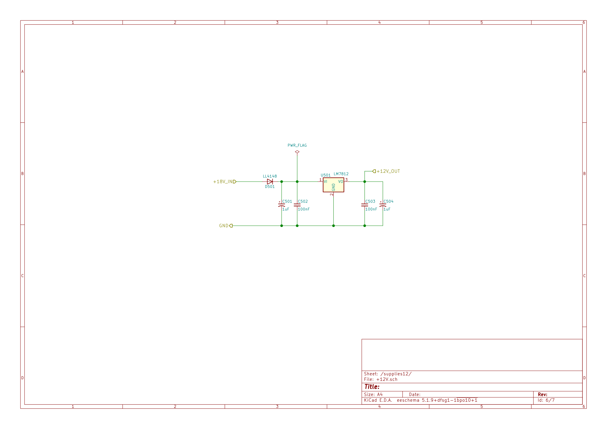
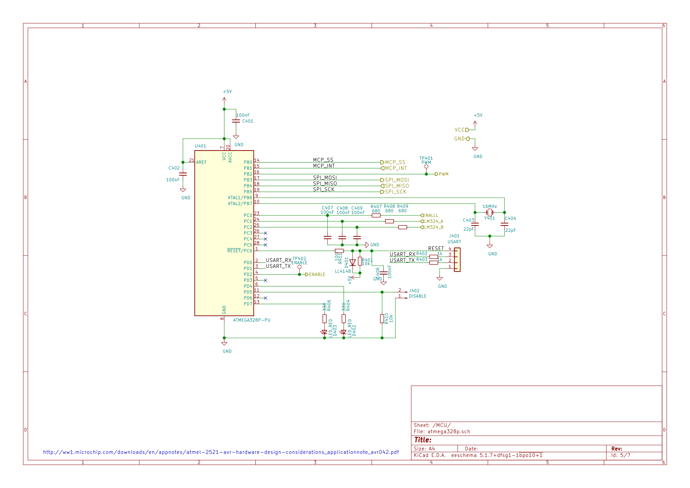
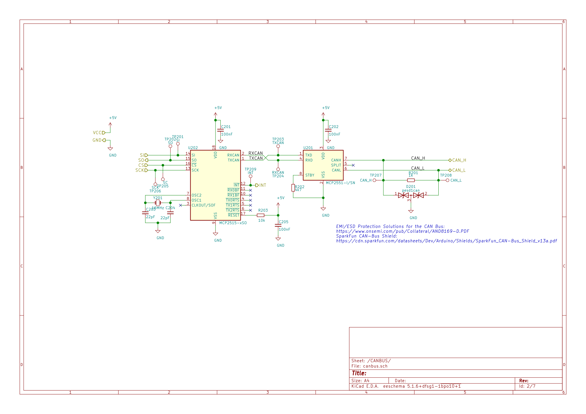
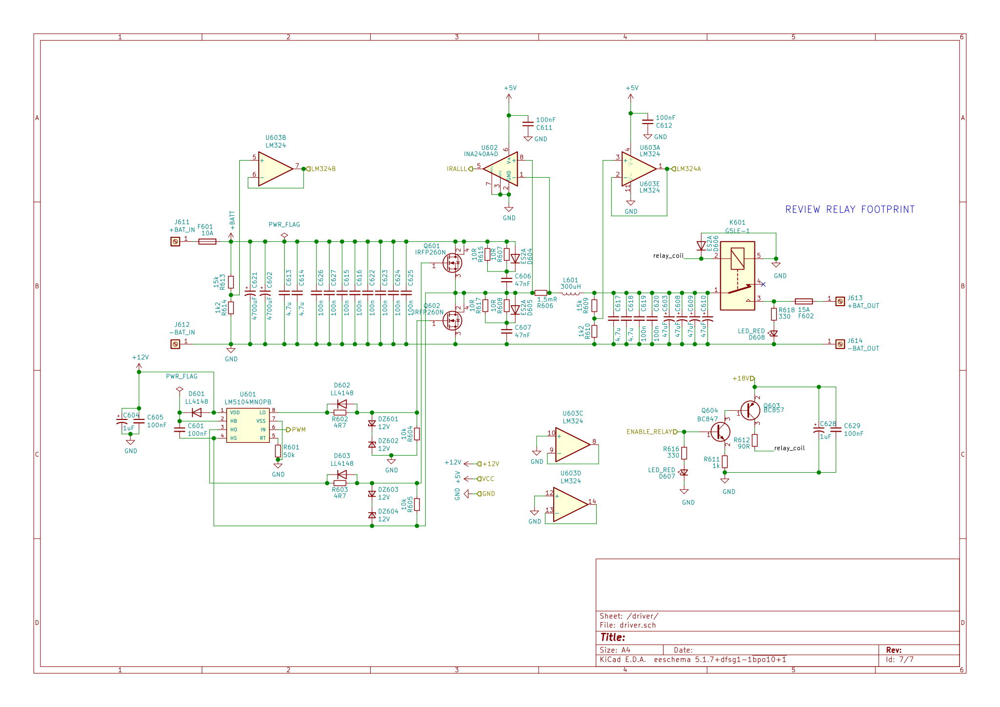
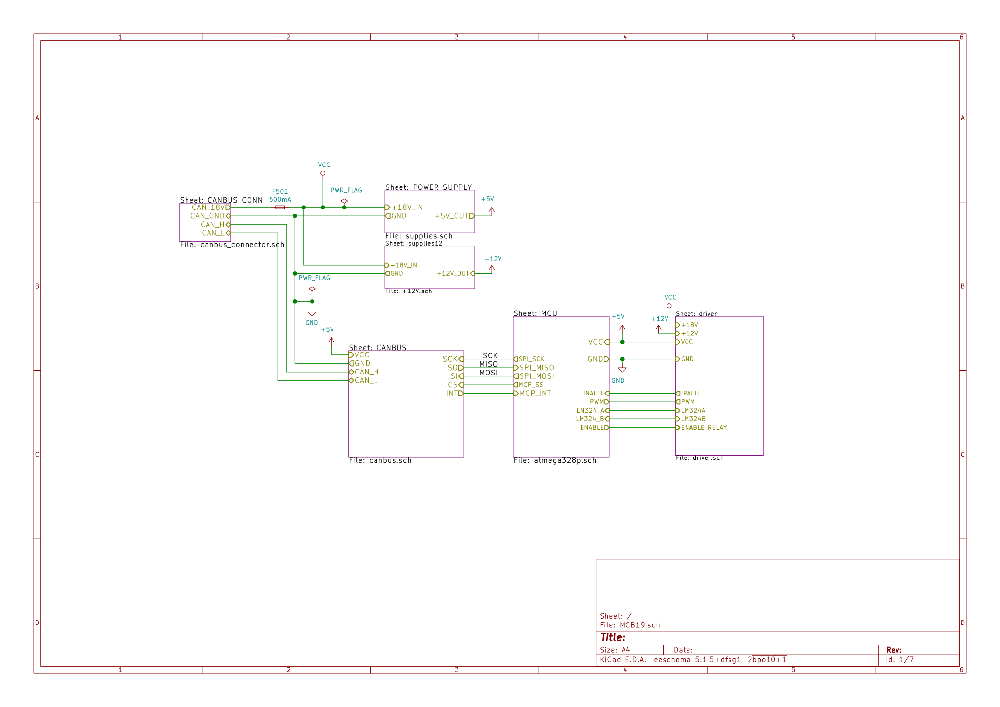

# Schematics

  - [.pdf Download](schematics/*-Schematic.pdf)
## +12V-supplies12

## atmega328p-MCU

## canbus-CANBUS

## canbus_connector-CANBUS CONN

## driver-driver

## MCB19-Schematic

## supplies-POWER SUPPLY

